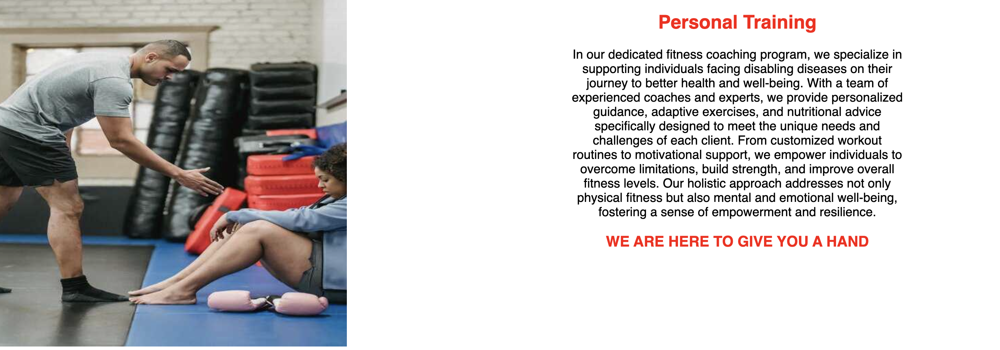

# Online Monster
Welcome to [Online Monster Website](https://ivost98.github.io/fitness1/)

 This platform is designed to provide you with resources and guidance on your fitness journey. Specialize in supporting individuals facing disabling diseases online, on their journey to better health and well-being.
 
  Users of the website it will be able to find information as: day working hours, information about the team, what offer the website, biography about the coaches, conctact and sign up form.
  
  

  ## Features
**Header with Navigation**

* Our top left corner in the navigation, shows the name of our page - Online Monster!
* Featured on all three pages, the full responsive navigation bar which opens every ot the links Home page, Coaches and Contact Us to a new page and is identical in each page to allow for easy navigation.
* The color it's contrast black and white and the sections of informations are easy to be find, which good first impression
to the user.

**Section Personal Training**

* The section introduces an image which is a coach helping to a client,reason is to grab the user attention.
* The text it's in black and red, which is in a perfect contrast with the background.
* With clear information that the website it's for personal training , for individuals facing disabling diseases and how it will help them to achieve their goals.
* In the end the section is with motivation message for the users.

**Section About Us**

* With black background and red and white text showing the contrast with the section above and on the bottom of this section
* Section About us shows exactly the way how the coaches will gonna help the user - through online sessions.

