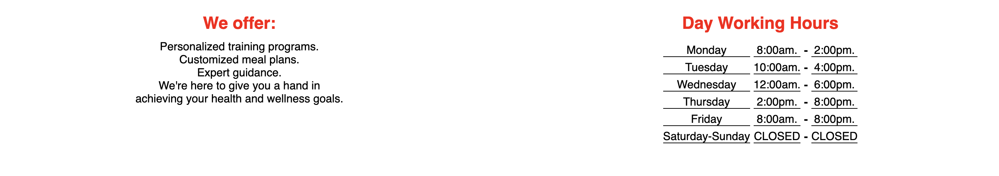
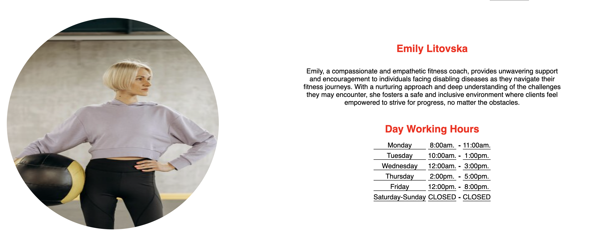
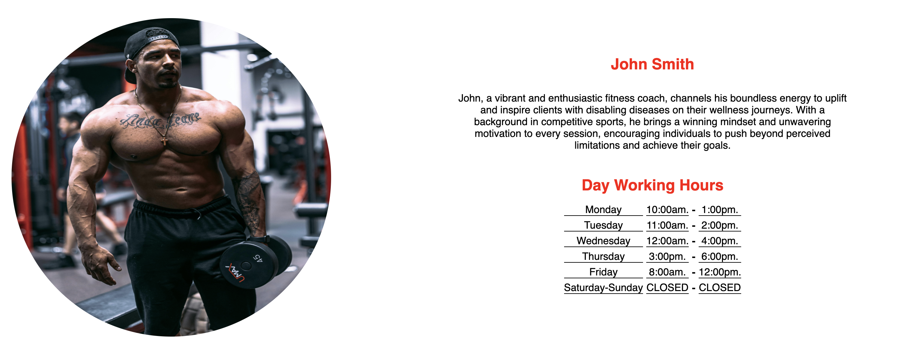
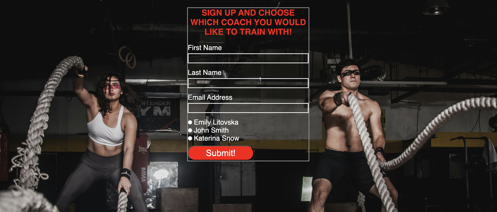

# Online Monster
Welcome to [Online Monster Website](https://ivost98.github.io/fitness1/)

 This platform is designed to provide you with resources and guidance on your fitness journey. Specialize in supporting individuals facing disabling diseases online, on their journey to better health and well-being.
 
  Users of the website it will be able to find information as: day working hours, information about the team, what offer the website, biography about the coaches, conctact and sign up form.
  
  

  ## Features
**Header with Navigation**

* Our top left corner in the navigation, shows the name of our page - Online Monster!
* Featured on all three pages, the full responsive navigation bar which opens every ot the links Home page, Coaches and Contact Us to a new page and is identical in each page to allow for easy navigation.
* The color it's contrast black and white and the sections of informations are easy to be find, which good first impression
to the user.
* Тhe position of the navigation it's fixed to be easier for the user when he/she decide to change the page.


[Тhe sections below is relative to the Home Page](https://ivost98.github.io/fitness1/)

**Section Personal Training**

* The section introduces an image which is a coach helping to a client,reason is to grab the user attention.
* The text it's in black and red, which is in a perfect contrast with the background.
* With clear information that the website it's for personal training , for individuals facing disabling diseases and how it will help them to achieve their goals.
* In the end the section is with motivation message for the users.


**Section About Us**

* With black background and red and white text showing the contrast with the section above and on the bottom of this section
* Section About us shows exactly the way how the coaches will gonna help the user - through online sessions.


**Section We offer and Working time**

* On the left side of the section is division We Offer with contrast black and red text.
* The divison gives information about what the website offer to the users.
* On the other right side of the section is the devision about Working time with the same color.
* Giving a details which days and time it's open and which is closed.



**The Footer**

* The footer section includes links to the social media Online Monster pages, which will be open in a new link.
* The conctact form is provides an e-mail and phone contact if there has any questions.
* The footer is identical on every page, allowing the user to connect immediately if needed.


  

  [Тhe sections below is relative to the Coaches Page](https://ivost98.github.io/fitness1/coaches.html)

  **Coaches File**

  * The coaches folder represent img of every one of the trainers.
  * And also give information what is the name of the coach, short autobiography and working days and hours.
  * With contrast red and black text on the white background for beter visual effect.


  
  

  [Тhe sections below relative to the Contact Us Page](https://ivost98.github.io/fitness1/contactus.html)

  **Sign Up and Choose a Coach**

  * With creative background image which gives better user experiance.
  * The sign up form is designed to colect data as a full name and e-mail address.
  * It also give a choise with which coach the user will would like to train together.

  

  ## Future Features

* First step it will be to add blog file with more information about training programs for individuals facing disabling diseases.
* Second in the blog to have information about meal plans.
* Next it will be added more offers. Not only meal and training plan, and coaching, also there will have an offer for taking care about your body and soul.
* Will be add an meditation and yoga program.
* Videos about people with different disabling diseases changes, user to see how nothing is imposible.
* Will be created an online comunity which is connected with the website, where people exchange advises.

## Color
* The main colors which were used for the project Online Monsters are: black, white and red.
* The idea for the three different color scheme was taken from [Adobe Color](https://color.adobe.com/create/color-wheel)

## Typography
* The main and only font used ina Online Monster is - Black 900 used in sans-serif. 

## Wireframes
* [For Home page](https://github.com/IvoSt98/fitness1/blob/main/assets/wireframes/home.png)
* [For page Coaches](https://github.com/IvoSt98/fitness1/blob/main/assets/wireframes/coaches.png)
* [For page Contact us](https://github.com/IvoSt98/fitness1/blob/main/assets/wireframes/contactus.png)

## Tehnology Used
* The code was written with [HTML5](https://de.wikipedia.org/wiki/HTML5)
* The style was made with [CSS3](https://de.wikipedia.org/wiki/Cascading_Style_Sheets)
* The [Google Fonts](https://fonts.google.com/) was used to give style to the whole project text.
* The [Font Awesome](https://fontawesome.com/) was used to give icons in the footer.
* [Git](https://git-scm.com/) was used for version control by utilizing the Gitpod terminal to commit to Git and Push to GitHub.
* [Git Hub](https://github.com/) was used to store the project.
* [Balsamiq](https://balsamiq.com/) to create wireframes about project prototype.
* [Favicon Converter](https://favicon.io/favicon-converter/) was used to convert img to favicon.

## Code Validation

* The code was tested with [W3C Markup Validator](https://jigsaw.w3.org/css-validator/#validate_by_input) with a [bug](https://github.com/IvoSt98/fitness1/commit/713f4563b8baa15b1812f484e9e4bd5f1da062e5) i just copied and pasted the content,and didn't change the ids with class atributes. The bug was fixed and everything working normlal.
* Second bug was that the nav elements was without closing tag this creates bug with which when you clike somewhere on the page it send you to the Contact Us file.[The bug code](https://github.com/IvoSt98/fitness1/commit/aee94a5955128881246b1651fe07260af20d2b09#diff-0eb547304658805aad788d320f10bf1f292797b5e6d745a3bf617584da017051)
            
* [Click here to see the Result without bugs](https://validator.w3.org/nu/?doc=https%3A%2F%2Fivost98.github.io%2Ffitness1%2F)

* The code was tested with [W3C CSS Validator](https://jigsaw.w3.org/css-validator/#validate_by_input) without any bugs [Result](https://jigsaw.w3.org/css-validator/validator?uri=https%3A%2F%2Fivost98.github.io%2Ffitness1%2F&profile=css3svg&usermedium=all&warning=1&vextwarning=&lang=en)

### Further Testing
1. The Website was tested on Google Chrome, Internet Explorer, Microsoft Edge and Safari browsers.
2. The website was viewed on a variety of devices such as Desktop, Laptop, iPhone7, iPhone 8 & iPhoneX.
3. Friends and family members were asked to review the site and documentation to point out any bugs and/or user experience issues.
 
 ## Deployment
 
 ### GitHub Pages
The project was deployed to GitHub Pages using the following steps...

1. Log in to GitHub and locate the [GitHub Repository](https://github.com/IvoSt98/fitness1?tab=readme-ov-file)
2. At the top of the Repository (not top of page), locate the "Settings" Button on the menu.
-Alternatively Click [Here](https://github.com/IvoSt98/fitness1/settings) for a GIF demonstrating the process starting from Step 2.
3. Scroll down the Settings page until you locate the "GitHub Pages" Section.
4 .Under "Source", click the dropdown called "None" and select "Master Branch".
5. The page will automatically refresh.
6. Scroll back down through the page to locate the now published site [link](https://github.com/IvoSt98/fitness1?tab=readme-ov-file) in the "GitHub Pages" section, it will be under the name Depployments.


## Forking the GitHub Repository

By forking the GitHub Repository we make a copy of the original repository on our GitHub account to view and/or make changes without affecting the original repository by using the following steps...

1. Log in to GitHub and locate the GitHub Repository
2. At the top of the [Repository](https://github.com/IvoSt98/fitness1)  between Watch and Star btuons on the menu, is locate the "Fork" Button.
3. You should now have a copy of the original repository in your GitHub account.

### Making a Local Clone

1. Log in to GitHub and locate the [GitHub Repository](https://github.com/IvoSt98/fitness1)
2. Under the repository name, click "Clone or download".
3. To clone the repository using HTTPS, under "Clone with HTTPS", copy the link.
4. Open Git Bash
5. Change the current working directory to the location where you want the cloned directory to be made.
6. Type ```git clone```, and then paste the URL you copied in Step 3.

git clone https://github.com/IvoSt98/fitness1"

7. Press Enter. Your local clone will be created.

"$ git clone https://github.com/YOUR-USERNAME/YOUR-REPOSITORY"

"> Cloning into `Spoon-Knife`..."

"> remote: Counting objects: 10, done."

"> remote: Compressing objects: 100% (8/8), done."

"> remove: Total 10 (delta 1), reused 10 (delta 1)"

"> Unpacking objects: 100% (10/10), done."

Click [Here](https://docs.github.com/en/repositories/creating-and-managing-repositories/cloning-a-repository#cloning-a-repository-to-github-desktop) to retrieve pictures for some of the buttons and more detailed explanations of the above process.

## Credits

### Content
* The code to make social media links was taken from [Love Runnign project](https://github.com/Code-Institute-Solutions/love-running-v3/blob/main/3.7-creating-the-footer/index.html)
* The code for the asterix selector was taken form [Love Running](https://github.com/Code-Institute-Solutions/love-running-v3/blob/main/3.2-add-stylesheet-with-starter-styles/assets/css/style.css)
* To code to center the sign up form was used from [MDN Web Docs :](https://developer.mozilla.org/en-US/docs/Web/CSS/Layout_cookbook/Center_an_element)
* The idea for the README.md file is from [Code Institute](https://github.com/Code-Institute-Solutions/SampleREADME?tab=readme-ov-file#typography)

### Media
* The images used in the website was taken from [Pexels](https://www.pexels.com/collections/at-the-gym-bx2voen/)
