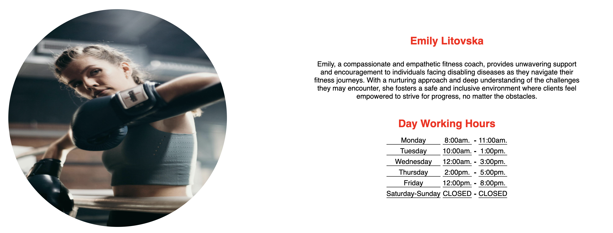

# Online Monster
Welcome to [Online Monster Website](https://ivost98.github.io/fitness1/)

 This platform is designed to provide you with resources and guidance on your fitness journey. Specialize in supporting individuals facing disabling diseases online, on their journey to better health and well-being.
 
  Users of the website it will be able to find information as: day working hours, information about the team, what offer the website, biography about the coaches, conctact and sign up form.
  
  

  ## Features
**Header with Navigation**

* Our header prominently displays the name of our platform - Online Monster.
* Consistently featured across all pages, our fully responsive navigation bar ensures seamless access to the Home page, Coaches, and Contact Us sections.
* With a contrasting black and white color scheme, the navigation sections are intuitively organized for user convenience.
* The fixed navigation position enhances user experience by facilitating effortless page transitions.


## User Stories

### First-Time Visitor Goals

**As a first-time visitor**
1. I aim to understand the primary focus of the website and learn more about the fitness organization.
2. I want to navigate seamlessly through the site's pages to discover its content.
3. I seek testimonials and social media links to gauge the organization's reputation and community engagement.
Returning Visitor Goals

**As a returning visitor**
1. I want to explore the profiles of the fitness coaches available.
2. I intend to learn about each coach's expertise, experience, and training philosophy.
3. I aim to find contact information for each coach to inquire about personal training sessions or classes.
Frequent User Goals

**As a frequent user**
1. I prioritize checking for updates on the organization's contact information.
2. I seek to find the best way to reach out to the organization for inquiries, feedback, or support.
3. I plan to explore the contact page regularly for any updates or changes to contact methods or information.


## Section Personal Training

[Тhe sections below is relative to the Home Page](https://ivost98.github.io/fitness1/)


* The section provides a captivating image of a coach assisting a client, designed to grab the user's attention.
* Text is presented in black and red, ensuring optimal contrast with the background.
* Clear information emphasizes the website's focus on personal training for individuals facing disabling diseases, * highlighting how it facilitates goal achievement.
* The section concludes with a motivational message to inspire users.


## Section About Us

* Against a black background, red and white text effectively contrasts with the preceding section and the section below.
* The "About Us" section elucidates how coaches will assist users through online sessions, emphasizing the organization's commitment to personalized support.


## Section We offer and Working time

* The "We Offer" section, with its contrast of black and red text, provides comprehensive information about the website's offerings.
* Conversely, the "Working Time" section, also employing the same color scheme, specifies operational hours, ensuring clarity regarding accessibility.


## The Footer

* The footer section features links to Online Monster's social media pages, opening in new tabs for user convenience.
* Additionally, the contact form provides email and phone contact options for inquiries.
* Consistently present across all pages, the footer facilitates immediate user engagement.


  

  [Тhe sections below is relative to the Coaches Page](https://ivost98.github.io/fitness1/coaches.html)

  ## Coaches File

* The coaches folder showcases images of each trainer, accompanied by their name, a brief autobiography, and working hours.
* Utilizing a contrast of red and black text against a white background enhances visual impact.


  
  

  [Тhe sections below relative to the Contact Us Page](https://ivost98.github.io/fitness1/contactus.html)

  ## Sign Up and Choose a Coach

* Enhanced with a creative background image, the sign-up form offers an enriched user experience.
* Collecting essential data such as full name and email address, the form also enables users to select their preferred coach.
* The form is designed for seamless integration with the user's journey.


  

  ## Future Features

* Plans include incorporating a blog with detailed information about training programs tailored for individuals facing disabling diseases.
* The blog will further expand to encompass meal plans, enhancing the holistic approach to health and fitness.
* Additional offerings will include a diverse range of services aimed at nurturing both body and soul, including meditation and yoga programs.
* Video testimonials featuring individuals overcoming disabilities will inspire users, showcasing the possibilities of achievement.
* An online community will be established, fostering a supportive environment for users to exchange advice and experiences.


## Color
* The project's primary color palette comprises black, white, and red, meticulously selected to evoke a sense of professionalism and dynamism.
* The idea for the three different color scheme was taken from [Adobe Color](https://color.adobe.com/create/color-wheel)

## Typography
* The chosen font, Black 900 in a sans-serif style, has been carefully selected to maintain consistency and improve readability across the entire project.

## Wireframes
* [For Home page](https://github.com/IvoSt98/fitness1/blob/main/assets/wireframes/home.png)
* [For page Coaches](https://github.com/IvoSt98/fitness1/blob/main/assets/wireframes/coaches.png)
* [For page Contact us](https://github.com/IvoSt98/fitness1/blob/main/assets/wireframes/contactus.png)

## Tehnology Used
* [HTML5](https://de.wikipedia.org/wiki/HTML5) and [CSS3](https://de.wikipedia.org/wiki/Cascading_Style_Sheets) were employed for code development. 

* [Google Fonts](https://fonts.google.com/) provided styling for the text elements.
* [Font Awesome](https://fontawesome.com/) contributed icons to the footer section.
* [Git](https://git-scm.com/) facilitated version control, with [Git Hub](https://github.com/) serving as the repository.
* [Balsamiq](https://balsamiq.com/)  aided in creating wireframes for project visualization.
* [Favicon Converter](https://favicon.io/favicon-converter/) was utilized for converting images to favicons.

## Code Validation

* The code was tested with [W3C Markup Validator](https://jigsaw.w3.org/css-validator/#validate_by_input) with a [bug](https://github.com/IvoSt98/fitness1/commit/713f4563b8baa15b1812f484e9e4bd5f1da062e5) i just copied and pasted the content,and didn't change the ids with class atributes. The bug was fixed and everything working normlal.
* Second bug was that the nav elements was without closing tag this creates bug with which when you clike somewhere on the page it send you to the Contact Us file.[The bug code](https://github.com/IvoSt98/fitness1/commit/aee94a5955128881246b1651fe07260af20d2b09#diff-0eb547304658805aad788d320f10bf1f292797b5e6d745a3bf617584da017051)
            
* [Click here to see the Result without bugs](https://validator.w3.org/nu/?doc=https%3A%2F%2Fivost98.github.io%2Ffitness1%2F)

* The code was tested with [W3C CSS Validator](https://jigsaw.w3.org/css-validator/#validate_by_input) without any bugs [Result](https://jigsaw.w3.org/css-validator/validator?uri=https%3A%2F%2Fivost98.github.io%2Ffitness1%2F&profile=css3svg&usermedium=all&warning=1&vextwarning=&lang=en)

* Lighthouse in DevTools confirmed the site's readability and accessibility.
### About Home page


### About Coaches page

### About Contact Us page


### Further Testing
1. The Website was tested on Google Chrome, Internet Explorer, Microsoft Edge and Safari browsers.
2. The website was viewed on a variety of devices such as Desktop, Laptop, iPhone7, iPhone 8 & iPhoneX.
3. Friends and family members were asked to review the site and documentation to point out any bugs and/or user experience issues.
 
 ## Deployment
 
 ### GitHub Pages
The project was deployed to GitHub Pages using the following steps...

1. Log in to GitHub and locate the [GitHub Repository](https://github.com/IvoSt98/fitness1?tab=readme-ov-file)
2. At the top of the Repository (not top of page), locate the "Settings" Button on the menu.
-Alternatively Click [Here](https://github.com/IvoSt98/fitness1/settings) for a GIF demonstrating the process starting from Step 2.
3. Scroll down the Settings page until you locate the "GitHub Pages" Section.
4 .Under "Source", click the dropdown called "None" and select "Master Branch".
5. The page will automatically refresh.
6. Scroll back down through the page to locate the now published site [link](https://github.com/IvoSt98/fitness1?tab=readme-ov-file) in the "GitHub Pages" section, it will be under the name Depployments.


## Forking the GitHub Repository

By forking the GitHub Repository we make a copy of the original repository on our GitHub account to view and/or make changes without affecting the original repository by using the following steps...

1. Log in to GitHub and locate the GitHub Repository
2. At the top of the [Repository](https://github.com/IvoSt98/fitness1)  between Watch and Star btuons on the menu, is locate the "Fork" Button.
3. You should now have a copy of the original repository in your GitHub account.

### Making a Local Clone

1. Log in to GitHub and locate the [GitHub Repository](https://github.com/IvoSt98/fitness1)
2. Under the repository name, click "Clone or download".
3. To clone the repository using HTTPS, under "Clone with HTTPS", copy the link.
4. Open Git Bash
5. Change the current working directory to the location where you want the cloned directory to be made.
6. Type ```git clone```, and then paste the URL you copied in Step 3.

git clone https://github.com/IvoSt98/fitness1"

7. Press Enter. Your local clone will be created.

"$ git clone https://github.com/YOUR-USERNAME/YOUR-REPOSITORY"

"> Cloning into `Spoon-Knife`..."

"> remote: Counting objects: 10, done."

"> remote: Compressing objects: 100% (8/8), done."

"> remove: Total 10 (delta 1), reused 10 (delta 1)"

"> Unpacking objects: 100% (10/10), done."

Click [Here](https://docs.github.com/en/repositories/creating-and-managing-repositories/cloning-a-repository#cloning-a-repository-to-github-desktop) to retrieve pictures for some of the buttons and more detailed explanations of the above process.

## Credits

### Content
* The code to make social media links was taken from [Love Runnign project](https://github.com/Code-Institute-Solutions/love-running-v3/blob/main/3.7-creating-the-footer/index.html)
* The code for the asterix selector was taken form [Love Running](https://github.com/Code-Institute-Solutions/love-running-v3/blob/main/3.2-add-stylesheet-with-starter-styles/assets/css/style.css)
* To code to center the sign up form was used from [MDN Web Docs :](https://developer.mozilla.org/en-US/docs/Web/CSS/Layout_cookbook/Center_an_element)
* The idea for the README.md file is from [Code Institute](https://github.com/Code-Institute-Solutions/SampleREADME?tab=readme-ov-file#typography)

### Media
* The images used in the website was taken from [Pexels](https://www.pexels.com/collections/at-the-gym-bx2voen/)
